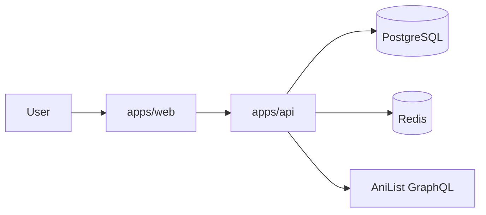

# Anilyst — Product & Delivery Plan

Living document for what Anilyst is, how it is built, and the order of work. Setup and scripts live in [`README.md`](README.md). The original detailed roadmap/timeline is in [`Anilyst_Monorepo_Project_Roadmap.pdf`](Anilyst_Monorepo_Project_Roadmap.pdf).

---

## Final product

Anilyst is an **anime tracking platform** where users:

- Mark and track what they watch (statuses, ratings, progress, favorites)
- Browse and search a full anime catalog powered by the **AniList GraphQL API** (catalog metadata stays external; the database stores user and library data only)
- Get personalized recommendations
- Later: social graph, personal analytics, and AI-assisted discovery and planning

### Product shape at “done” (Phase 10)

| Surface    | Role                                                                               |
| ---------- | ---------------------------------------------------------------------------------- |
| `apps/web` | Next.js 15 app — landing, auth, dashboard, catalog, library, social, analytics, AI |
| `apps/api` | Express API — auth, library, AniList proxy/cache, recommendations, social, AI      |
| Data       | PostgreSQL (user/library), Redis (cache/sessions), AniList (catalog)               |
| Deploy     | Vercel (web), Railway (api), Neon (Postgres), Upstash (Redis), Sentry + Plausible  |

Shared packages: `types`, `validation`, `config`, `eslint-config`, `utils`, and `ui` (design system, Phase 2).



### Tech stack

| Layer    | Stack                                                                                   |
| -------- | --------------------------------------------------------------------------------------- |
| Frontend | Next.js 15, TypeScript, Tailwind CSS, shadcn/ui, Zustand, TanStack Query, Framer Motion |
| Backend  | Express, TypeScript, Prisma, JWT                                                        |
| Data     | PostgreSQL, Redis, AniList GraphQL                                                      |
| Tooling  | Turborepo, pnpm, Docker, GitHub Actions                                                 |

---

## Current status

**Phase 0 is complete.** Next work is Phase 1 (auth + Prisma + AniList client).

### Done (Phase 0)

- pnpm + Turborepo workspace
- `apps/web` (Next.js 15 landing page)
- `apps/api` (`/` and `/health`)
- Packages: `types`, `validation`, `utils`, `config`, `eslint-config`
- Prettier + ESLint
- Husky + lint-staged + Commitlint
- GitHub Actions CI (`.github/workflows/ci.yml`)
- Docker Compose (PostgreSQL 16 + Redis 7)
- Env examples

### Upcoming (later phases)

- Phase 1: Prisma, JWT auth, AniList client + Redis cache
- Phase 2: `packages/ui`, frontend shell
- Phase 10: production Dockerfiles / deploy targets

---

## How we proceed

| Phase | Focus               | Outcome                                                                    |
| ----- | ------------------- | -------------------------------------------------------------------------- |
| 0     | Foundation          | Monorepo, tooling, Docker — **complete**                                   |
| 1     | Backend foundation  | JWT auth, Prisma models, layered API, AniList service + cache              |
| 2     | Frontend foundation | Landing/auth/dashboard shell, design system, dark/light                    |
| 3     | Anime database      | Search, trending, seasonal, detail (studios, genres, characters, trailers) |
| 4     | User library        | Statuses, ratings, notes, favorites, episode progress, dashboard stats     |
| 5     | Recommendations     | Genre/tag similarity, popularity, community signals                        |
| 6     | Social              | Friends/follow, shared lists, reviews/comments/likes, activity feed        |
| 7     | Analytics           | Genre mix, watch time, studios, completion, calendar                       |
| 8     | AI                  | NL search, AI recs, review summaries, watch planner                        |
| 9     | Polish              | PWA, notifications, SEO, a11y, offline, perf                               |
| 10    | Deployment          | Prod stack + CI/CD                                                         |

### Phase details

**Phase 0 — Project foundation**  
Turborepo/pnpm workspace, Next.js + Express apps, TypeScript, ESLint, Prettier, Husky, lint-staged, Commitlint, GitHub Actions, Docker Compose, folder structure.

**Phase 1 — Backend foundation**  
Authentication (register / login / JWT / refresh / logout). Prisma models (Users, Sessions; later Watchlist, Ratings, Reviews, Favorites). Layered architecture (controllers, services, repositories, middleware, validation, logging). AniList service with Redis caching.

**Phase 2 — Frontend foundation**  
Landing, Login, Signup, Dashboard, Anime, Search, and Profile pages. Shared UI (`packages/ui`), responsive design, dark/light mode, animations.

**Phase 3 — Anime database**  
AniList integration for search, trending, seasonal, popular, upcoming, top rated, studios, genres, characters, voice actors, recommendations, trailers.

**Phase 4 — User library**  
Track statuses (Watching, Completed, Dropped, Paused, Plan to Watch), ratings, notes, favorites, episode progress, and dashboard statistics.

**Phase 5 — Recommendation engine**  
Genre/tag similarity, popularity, community recommendations. Future: AI embeddings and cosine similarity.

**Phase 6 — Social features**  
Friends, following, shared lists, reviews, comments, likes, activity feed.

**Phase 7 — Analytics**  
Genre distribution, yearly trends, watch time, favorite studios, completion rate, watch calendar.

**Phase 8 — AI features**  
Natural-language search, AI recommendations, review summaries, watch planner.

**Phase 9 — Polish**  
PWA support, notifications, SEO, accessibility, offline support, performance optimization and caching.

**Phase 10 — Deployment**  
Frontend on Vercel; backend on Railway; Neon PostgreSQL; Upstash Redis; Sentry monitoring; Plausible analytics; CI/CD via GitHub Actions.

---

## Database evolution

| When    | Models                                          |
| ------- | ----------------------------------------------- |
| Phase 1 | User, Session                                   |
| Phase 4 | WatchList, Rating, Favorites, Review            |
| Phase 6 | Followers, Activity, Comments, Likes            |
| Phase 8 | RecommendationHistory, AIQueries, UserEmbedding |

---

## Git branch strategy

```
main
develop
feature/auth
feature/anilist
feature/watchlist
feature/dashboard
feature/recommendation
feature/social
feature/analytics
```

Work lands on `feature/*` branches, merges into `develop`, then `main` for release.

---

## Immediate next steps

1. Phase 1: Prisma User/Session models; register / login / JWT / refresh / logout
2. Layered API structure + AniList client with Redis cache
3. Phase 2 frontend shell (including `packages/ui` / design system) against real auth APIs
